# Project: Deploy a high-availability web app using CloudFormation
The hands-on experience for deploying a dummy application (a sample JavaScript or HTML file) to the Apache Web Server running on an EC2 instance.

## :building_construction: Architectural Diagram
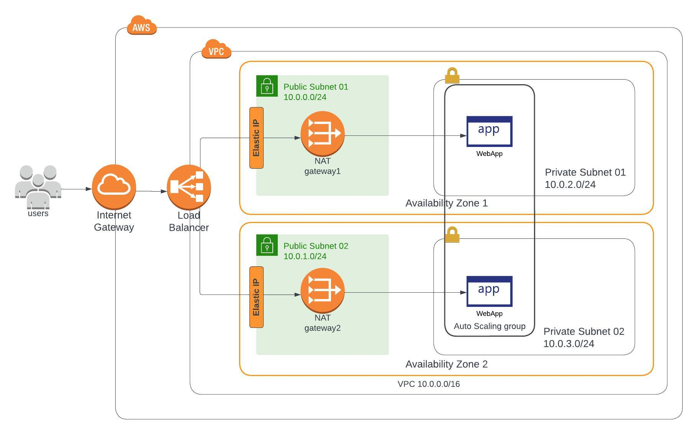
## :key: AWS Authorization:
### Powershell
>$env:AWS_ACCESS_KEY_ID = "YOUR-ACCESS-KEY-ID"
>
>$env:AWS_SECRET_ACCESS_KEY = "YOUR-SECRET-ACCESS-KEY"
>
>$env:AWS_SESSION_TOKEN = "YOUR-SESSION_TOKEN"
>
>$env:AWS_DEFAULT_REGION="us-east-1"

## :page_facing_up: Cloudformation Scripts
> cd high-availability-web-app
### 1.Create parameter stores stack
>aws cloudformation create-stack --stack-name iac-ssm-stack --template-body file://infrastructure-stack/ssm-stack.yml --capabilities "CAPABILITY_IAM" "CAPABILITY_NAMED_IAM"

#### :star: Deploy ssm-stack
>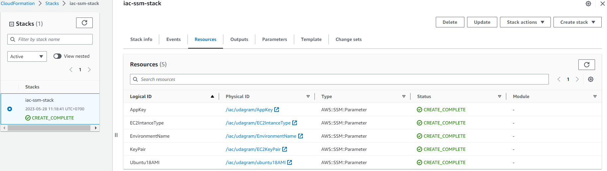

### 2.Create network stack
> aws cloudformation create-stack --stack-name iac-network-stack --template-body file://infrastructure-stack/network-stack.yml  --capabilities "CAPABILITY_IAM" "CAPABILITY_NAMED_IAM"

#### :star: Deploy network-stack
>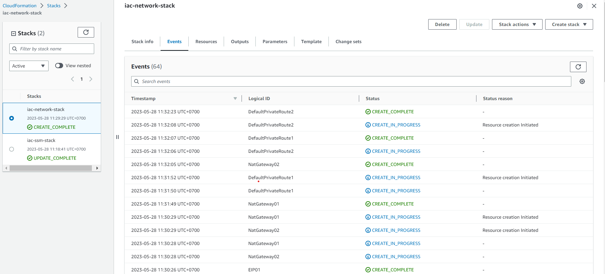
#### :star: VPC Resource map
>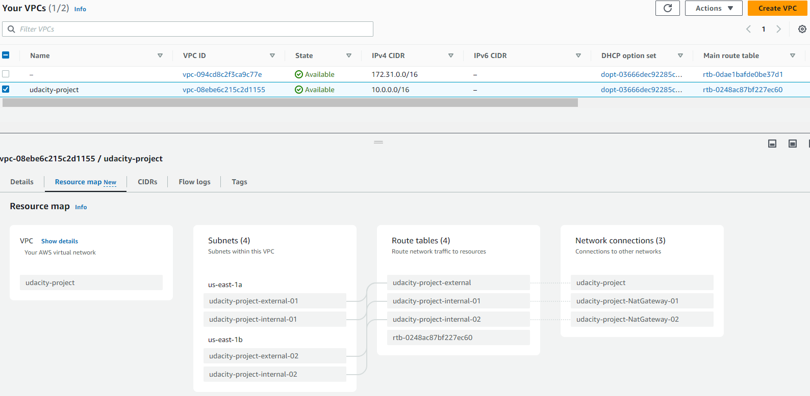

### 3.Create webserver stack
> aws cloudformation create-stack --stack-name iac-server-stack --template-body file://infrastructure-stack/server-stack.yml  --capabilities "CAPABILITY_IAM" "CAPABILITY_NAMED_IAM"

#### :star: Deploy server-stack with Load Balancer DNS URL
>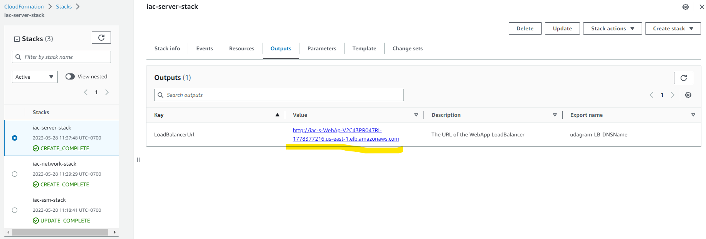

#### :star: LoadBalancer
>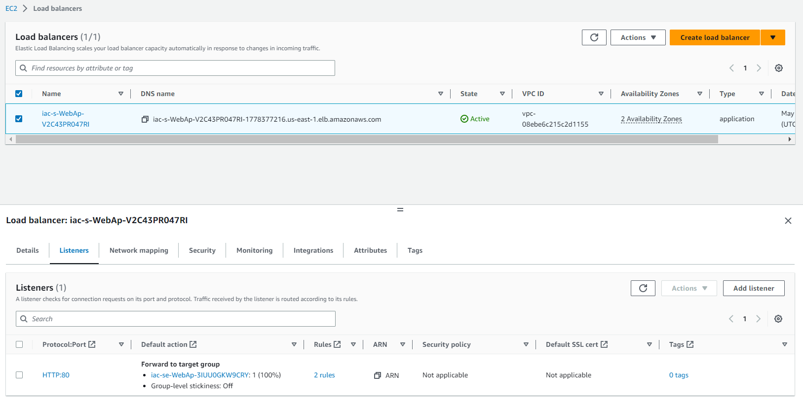

#### :star: Launch Configuration
>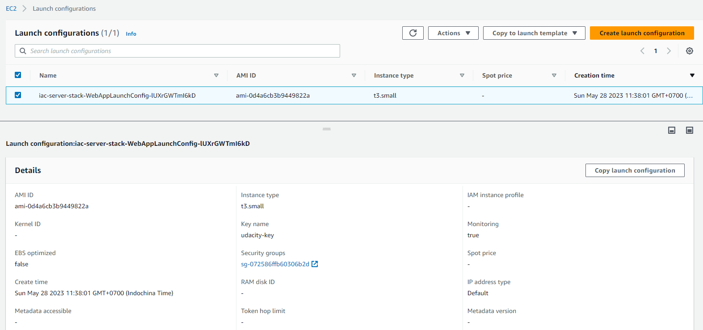

#### :star: AutoScaling group
>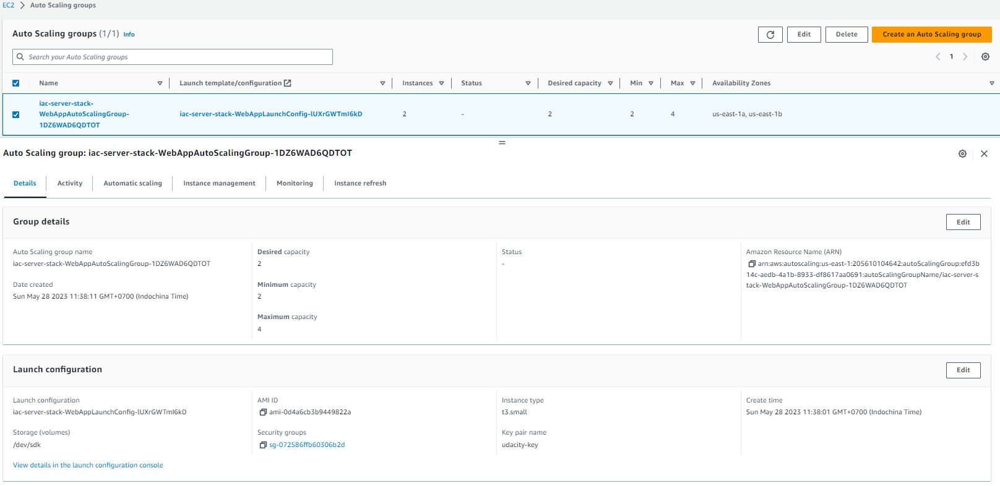

#### :star: Health Check
>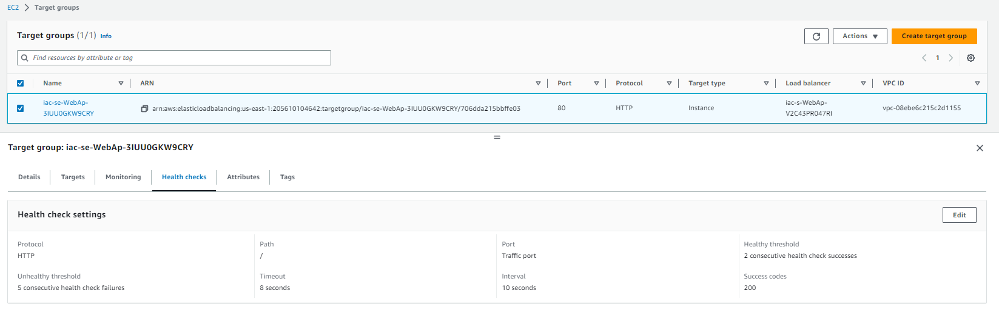

#### :star: Working Test
>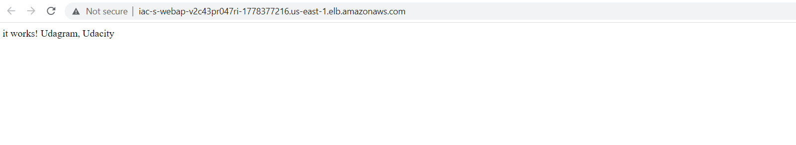

### 3.Create Bastion Host / jumpbox stack (option)
> aws cloudformation create-stack --stack-name iac-jumpbox-ec2-stack --template-body file://infrastructure-stack/jumpbox-ec2-stack.yml --capabilities "CAPABILITY_IAM" "CAPABILITY_NAMED_IAM"

#### :star: Deploy jumpbox-stack
>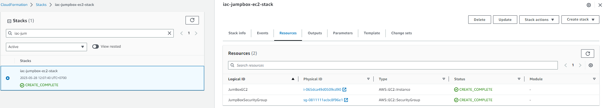

### 4.Create shared iam roles stack (option)
> aws cloudformation create-stack --stack-name iac-shared-roles-stack --template-body file://infrastructure-stack/shared-roles-stack.yml --capabilities "CAPABILITY_IAM" "CAPABILITY_NAMED_IAM"

## :x: Destroy Cloudformation

### 1.Delete webserver stack
> aws cloudformation delete-stack --stack-name iac-server-stack

### 2.Delete network stack
> aws cloudformation delete-stack --stack-name iac-network-stack

### 2.Delete jumpbox-ec2 stack (option)
> aws cloudformation delete-stack --stack-name iac-jumpbox-ec2-stack

